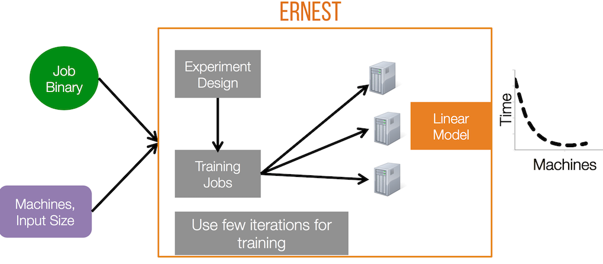

## Ernest: Efficient Performance Prediction for Advanced Analytics

Ernest is a performance prediction framework for analytics jobs developed using frameworks like Apache Spark and run on cloud computing infrastructure. 

One of the main challenges in deploying large scale analytics applications in
the cloud is choosing the right hardware configuration. Specifically in Amazon
EC2 or Google Compute Engine clusters, choosing the right instance type and the
right number of instances can significantly improve performance or lower cost. 

Ernest is a performance prediction framework that helps address this problem.
Ernest builds performance models based on the behavior of the job on small
samples of data and then predicts its performance on larger datasets and cluster
sizes. To minimize the time and resources spent in building a model, Ernest
uses [optimal experiment design](https://en.wikipedia.org/wiki/Optimal_design),
a statistical technique that allows us to collect as few training points as
required. For more details please see our [paper]
(http://shivaram.org/publications/ernest-nsdi.pdf) and [talk slides](http://shivaram.org/talks/ernest-nsdi-2016.pdf) from NSDI 2016.

### Installing Ernest

The easiest way to install Ernest is by cloning this repository.

Running Ernest requires installing [SciPy](http://scipy.org), [NumPy](http://numpy.org) and
[CVXPY](http://www.cvxpy.org). An easy way to do this is using the `requirements.txt` file.

```
pip install -r requirements.txt
```

### Using Ernest

At a high level there are three main steps to use Ernest as summarized in the following figure.

<p style="text-align: center;">
  
</p>

These include:

1. Determining what sample data points to collect. To do this we will be using experiment design
   implemented in [expt_design.py](expt_design.py). This will return the set of training data points
required to build a performance model.  
2. Collect running time for the set of training data points. These can be executed using [Spark EC2
   scripts](http://github.com/amplab/spark-ec2) or Amazon EMR etc.
3. Building a performance model and using it for prediction. To do this we create a CSV file with
   measurements from previous step and use [predictor.py](predictor.py). 

For a more detailed example you can see our [example](examples/mllib_rcv1.md) on building a
performance model for Spark MLlib algorithms.

## Limitations, Work In Progress

One of the key insights that is used by Ernest is that a number of machine learning workloads are
iterative in nature and have predictable structure in terms of computation and communication.
Thus we are able to run a few iterations of the job on small samples of data to build a performance
model. However this assumption may not be valid for all workloads.

Further, to compare across instance types, we currently need to build a separate model for each instance
type. We are working on developing new techniques to share performance models across instance types.
